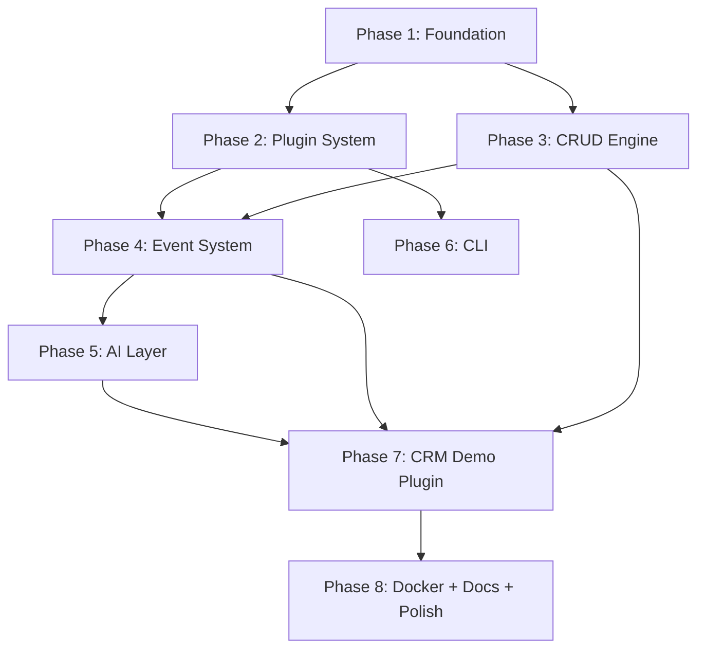

# NexusCore — Implementation Plan

A production-grade, AI-ready, plugin-driven backend framework for rapidly building enterprise applications.

## Background & Design Philosophy

NexusCore combines the best ideas from FastAPI (async, type safety, OpenAPI), Django (batteries-included, ORM), and Frappe (hooks, doctypes) — but stays lighter and more modular. Every subsystem is a **first-class abstraction** that can be used, replaced, or extended independently.

### Key Architectural Decisions

| Decision | Rationale |
|---|---|
| **Plugin = Python package with manifest** | Keeps plugins self-contained; enables dynamic discovery without import-time side effects |
| **Generic CRUD factory over code generation** | Avoids generated boilerplate; one source of truth per model |
| **Signal-based event system** | Decouples producers from consumers; O(1) registration, O(n) dispatch |
| **Provider abstraction for AI** | Swap OpenAI ↔ Anthropic ↔ local models without touching business logic |
| **Config layering: YAML → env → CLI** | Follows 12-factor app principles; works in dev, CI, and prod |
| **Async-first but sync-compatible** | FastAPI is async-native; we use async for I/O-bound ops, keep sync where clarity wins |

---

## Project Structure

```
c:\Users\Shreeji\Desktop\Pravaah\
├── nexuscore/                    # Framework package
│   ├── __init__.py               # Version + public API re-exports
│   ├── app/
│   │   ├── __init__.py
│   │   ├── main.py               # FastAPI app factory + lifespan
│   │   ├── core/
│   │   │   ├── __init__.py
│   │   │   ├── config.py          # Config loading (YAML + env)
│   │   │   ├── database.py        # SQLAlchemy engine + session factory
│   │   │   ├── exceptions.py      # Framework exception hierarchy
│   │   │   ├── registry.py        # Central plugin/model/hook registry
│   │   │   └── security.py        # API key / auth middleware (stub)
│   │   ├── engine/
│   │   │   ├── __init__.py
│   │   │   ├── crud.py            # Generic async CRUD factory
│   │   │   ├── router_factory.py  # Auto-generate FastAPI routers from models
│   │   │   └── pagination.py      # Reusable pagination schema
│   │   ├── events/
│   │   │   ├── __init__.py
│   │   │   ├── dispatcher.py      # Event bus + signal dispatch
│   │   │   └── decorators.py      # @on_create, @on_update, etc.
│   │   ├── plugins/
│   │   │   ├── __init__.py
│   │   │   ├── loader.py          # Plugin discovery + loading
│   │   │   ├── base.py            # Abstract NexusPlugin base class
│   │   │   └── manifest.py        # Plugin manifest schema
│   │   ├── ai/
│   │   │   ├── __init__.py
│   │   │   ├── service.py         # Unified AI service facade
│   │   │   ├── providers/
│   │   │   │   ├── __init__.py
│   │   │   │   ├── base.py        # Abstract AI provider
│   │   │   │   └── openai.py      # OpenAI provider implementation
│   │   │   └── templates.py       # Prompt template engine
│   │   ├── middleware/
│   │   │   ├── __init__.py
│   │   │   ├── error_handler.py   # Global exception handling
│   │   │   ├── request_id.py      # Request ID injection
│   │   │   └── logging.py         # Structured request logging
│   │   └── services/
│   │       ├── __init__.py
│   │       └── health.py          # Health check service
│   ├── cli/
│   │   ├── __init__.py
│   │   ├── main.py                # Typer app entry point
│   │   ├── commands/
│   │   │   ├── __init__.py
│   │   │   ├── run.py             # `nexus run`
│   │   │   ├── plugin.py          # `nexus create-plugin`, `nexus list-plugins`
│   │   │   └── model.py           # `nexus create-model`
│   │   └── templates/             # Scaffolding templates (Jinja2)
│   │       ├── plugin/
│   │       │   ├── __init__.py.j2
│   │       │   ├── plugin.py.j2
│   │       │   ├── models.py.j2
│   │       │   └── routes.py.j2
│   │       └── model.py.j2
│   └── plugins/                   # Built-in / demo plugins
│       └── crm/
│           ├── __init__.py
│           ├── plugin.py          # CRM plugin registration
│           ├── models.py          # Customer, Lead SQLAlchemy models
│           ├── schemas.py         # Pydantic schemas
│           ├── routes.py          # Custom routes (beyond auto-CRUD)
│           ├── hooks.py           # Event hook handlers
│           └── services.py        # CRM business logic + AI summaries
├── tests/
│   ├── __init__.py
│   ├── conftest.py                # Shared fixtures
│   ├── test_crud_engine.py
│   ├── test_event_system.py
│   ├── test_plugin_loader.py
│   └── test_crm_plugin.py
├── config/
│   └── nexus.yaml                 # Default config file
├── docs/
│   ├── architecture.md
│   └── getting-started.md
├── requirements.txt
├── requirements-dev.txt
├── pyproject.toml
├── Dockerfile
├── docker-compose.yml
├── .env.example
├── .gitignore
└── README.md
```

---

## Proposed Changes — Phased Build Order

The dependency graph dictates the build order. Each phase builds on the previous.



---

### Phase 1 — Foundation (Core Infrastructure)

> **Why first**: Everything depends on config, database, and the app factory.

#### [NEW] `nexuscore/__init__.py`
- Framework version constant (`__version__ = "0.1.0"`)
- Public API re-exports

#### [NEW] `config/nexus.yaml`
- Default configuration with sections: `app`, `database`, `ai`, `plugins`
- Sensible defaults for SQLite + development mode

#### [NEW] `nexuscore/app/core/config.py`
- `NexusConfig` Pydantic Settings model
- Layered loading: YAML file → environment variables → CLI overrides
- Nested config sections: `AppConfig`, `DatabaseConfig`, `AIConfig`
- Uses `pydantic-settings` for env var parsing with `NEXUS_` prefix

#### [NEW] `nexuscore/app/core/database.py`
- Async SQLAlchemy engine factory (`create_async_engine` for SQLite with aiosqlite)
- Async session factory (`async_sessionmaker`)
- `Base` declarative base with common columns (id, created_at, updated_at)
- `get_db` async dependency for FastAPI
- Auto-create tables on startup

#### [NEW] `nexuscore/app/core/exceptions.py`
- `NexusCoreError` base exception
- `PluginError`, `CRUDError`, `ConfigError`, `AIServiceError` hierarchy
- Each exception carries an HTTP status code for automatic error responses

#### [NEW] `nexuscore/app/core/registry.py`
- Singleton `NexusRegistry` — the central nervous system
- Stores: registered plugins, models, routes, hooks, services
- Thread-safe registration methods
- Provides introspection APIs (`list_plugins()`, `get_model()`, etc.)

#### [NEW] `nexuscore/app/core/security.py`
- Stub for API key authentication middleware
- `get_current_user` dependency placeholder
- Ready for future JWT / OAuth2 extension

#### [NEW] `nexuscore/app/middleware/error_handler.py`
- Global exception handler that converts `NexusCoreError` to structured JSON responses
- Catches unhandled exceptions with 500 + request ID

#### [NEW] `nexuscore/app/middleware/request_id.py`
- Middleware that injects `X-Request-ID` header (UUID4)
- Makes request ID available via context variable for logging

#### [NEW] `nexuscore/app/middleware/logging.py`
- Structured JSON logging middleware
- Logs: method, path, status, duration, request_id
- Uses Python's `logging` with structured formatters

#### [NEW] `nexuscore/app/services/health.py`
- Health check endpoint (`/health`)
- Returns: status, version, database connectivity, loaded plugins count

#### [NEW] `nexuscore/app/main.py`
- `create_app()` factory function — the heart of NexusCore
- FastAPI lifespan: initialize DB → load plugins → register routes → ready
- Registers middleware stack
- Mounts health check
- Configures OpenAPI metadata (title, description, version)

---

### Phase 2 — Plugin System

> **Why**: Plugins are the primary extensibility mechanism. Everything else plugs into this.

#### [NEW] `nexuscore/app/plugins/manifest.py`
- `PluginManifest` Pydantic model: name, version, description, dependencies, author
- Validated at load time; bad manifests fail fast with clear errors

#### [NEW] `nexuscore/app/plugins/base.py`
- `NexusPlugin` abstract base class with lifecycle hooks:
  - `setup(app, registry)` — register models, routes, hooks
  - `teardown()` — cleanup on shutdown
  - `manifest` property — returns `PluginManifest`
- Provides helper methods: `register_model()`, `register_routes()`, `register_hook()`

#### [NEW] `nexuscore/app/plugins/loader.py`
- `PluginLoader` class
- Discovery: scans `nexuscore/plugins/` directory + any paths from config
- Loads plugins via `importlib`, validates manifests
- Topological sort by dependencies (prevent circular deps)
- Calls `plugin.setup()` in dependency order
- Logs each loaded plugin with version

---

### Phase 3 — Auto CRUD Engine

> **Why**: This is the core productivity feature — define a model once, get full REST API.

#### [NEW] `nexuscore/app/engine/pagination.py`
- `PaginationParams` dependency: `page`, `page_size` with defaults and max limits
- `PaginatedResponse[T]` generic schema: `items`, `total`, `page`, `page_size`, `pages`

#### [NEW] `nexuscore/app/engine/crud.py`
- `CRUDBase[ModelType, CreateSchemaType, UpdateSchemaType]` generic class
- Async methods: `create()`, `get()`, `get_multi()`, `update()`, `delete()`
- All methods accept a `db: AsyncSession`
- `get_multi()` supports filtering, sorting, pagination
- Fires events through the event dispatcher (Phase 4 dependency — uses lazy dispatch)
- Clean error handling with `CRUDError`

#### [NEW] `nexuscore/app/engine/router_factory.py`
- `create_crud_router(model, create_schema, update_schema, read_schema, prefix, tags)` function
- Returns a `FastAPI.APIRouter` with 5 endpoints:
  - `POST /` — create
  - `GET /` — list (paginated)
  - `GET /{id}` — read one
  - `PUT /{id}` — update
  - `DELETE /{id}` — delete
- Each endpoint has proper OpenAPI docs, response models, status codes
- Injects `CRUDBase` instance via dependency injection
- Supports optional auth dependency per router

---

### Phase 4 — Event System

> **Why**: Enables loose coupling between plugins and cross-cutting concerns.

#### [NEW] `nexuscore/app/events/dispatcher.py`
- `EventDispatcher` singleton
- `register(event_name, handler, priority=0)` — register a handler for an event
- `async dispatch(event_name, payload)` — fire event, call all handlers in priority order
- Built-in events: `on_create:{model}`, `on_update:{model}`, `on_delete:{model}`, `on_startup`, `on_shutdown`
- Supports both sync and async handlers (auto-wraps sync in executor)
- Error isolation: one handler's failure doesn't block others (logged + continues)

#### [NEW] `nexuscore/app/events/decorators.py`
- `@on_create(model_name)` decorator
- `@on_update(model_name)` decorator
- `@on_delete(model_name)` decorator
- `@on_event(event_name)` generic decorator
- Decorators register handlers with the global dispatcher
- Deferred registration: handlers are collected, then registered when the plugin loads

---

### Phase 5 — AI Service Layer

> **Why**: First-class AI integration differentiates NexusCore from traditional frameworks.

#### [NEW] `nexuscore/app/ai/providers/base.py`
- `AIProvider` abstract base class
- Methods: `complete(prompt, **kwargs)`, `summarize(text)`, `generate(template, context)`
- Returns structured `AIResponse(text, model, usage, metadata)`

#### [NEW] `nexuscore/app/ai/providers/openai.py`
- `OpenAIProvider(AIProvider)` implementation
- Uses `openai` async client
- Configurable model, temperature, max_tokens
- Graceful error handling + retry with exponential backoff

#### [NEW] `nexuscore/app/ai/templates.py`
- `PromptTemplate` class with Jinja2-style variable substitution
- Built-in templates: `summarize`, `extract_entities`, `generate_report`
- Custom template registration via plugins

#### [NEW] `nexuscore/app/ai/service.py`
- `AIService` facade — the `ai` object in user code
- Methods: `generate_summary(data)`, `generate_report(data, template)`, `complete(prompt)`
- Provider-agnostic: reads `ai.provider` from config
- Graceful degradation: if AI is disabled, methods return `None` with warning
- Dependency-injectable in FastAPI routes

---

### Phase 6 — CLI Tooling

> **Why**: Developer experience. A great CLI makes the framework feel professional.

#### [NEW] `nexuscore/cli/main.py`
- Typer app with `nexus` as the entry point
- Sub-commands: `run`, `create-plugin`, `create-model`, `list-plugins`

#### [NEW] `nexuscore/cli/commands/run.py`
- `nexus run` — starts the FastAPI dev server via uvicorn
- Options: `--host`, `--port`, `--reload`, `--config`

#### [NEW] `nexuscore/cli/commands/plugin.py`
- `nexus create-plugin <name>` — scaffolds a new plugin directory from templates
- `nexus list-plugins` — discovers and lists all registered plugins

#### [NEW] `nexuscore/cli/commands/model.py`
- `nexus create-model <plugin> <model>` — scaffolds model + schema files

#### [NEW] `nexuscore/cli/templates/`
- Jinja2 templates for scaffolding plugins and models
- Generates properly structured files with imports and base classes

---

### Phase 7 — CRM Demo Plugin

> **Why**: Proves the framework works end-to-end. Shows the developer experience.

#### [NEW] `nexuscore/plugins/crm/plugin.py`
- `CRMPlugin(NexusPlugin)` — registers Customer + Lead models, routes, hooks
- Manifest: name="crm", version="0.1.0"

#### [NEW] `nexuscore/plugins/crm/models.py`
- `Customer` model: id, name, email, phone, company, status, notes, created_at, updated_at
- `Lead` model: id, name, email, source, status, score, assigned_to, created_at, updated_at

#### [NEW] `nexuscore/plugins/crm/schemas.py`
- Pydantic v2 schemas: `CustomerCreate`, `CustomerUpdate`, `CustomerRead`
- Same for Lead
- Proper validation rules (email format, string lengths)

#### [NEW] `nexuscore/plugins/crm/routes.py`
- Custom routes beyond CRUD (e.g., `POST /customers/{id}/summarize` — AI summary)
- `GET /crm/dashboard` — basic stats endpoint

#### [NEW] `nexuscore/plugins/crm/hooks.py`
- `@on_create("Customer")` — log new customer creation
- `@on_update("Lead")` — recalculate lead score
- Demonstrates the event system in action

#### [NEW] `nexuscore/plugins/crm/services.py`
- `CRMService` — business logic layer
- `generate_customer_summary(customer)` — uses AI service
- `calculate_lead_score(lead)` — scoring logic

---

### Phase 8 — Docker, Docs, Polish

#### [NEW] `Dockerfile`
- Multi-stage build: builder (install deps) → runtime (slim image)
- Non-root user, health check, proper signal handling

#### [NEW] `docker-compose.yml`
- Services: `nexuscore` (app), optional `postgres` for future use
- Volume mounts for config and plugins
- Environment variable pass-through

#### [NEW] `requirements.txt`
- Production dependencies pinned to compatible versions

#### [NEW] `requirements-dev.txt`
- Test + dev dependencies: pytest, pytest-asyncio, httpx, ruff

#### [NEW] `pyproject.toml`
- PEP 621 project metadata
- Entry point: `nexus = nexuscore.cli.main:app`
- Build system configuration

#### [NEW] `.env.example`
- Documented environment variables with defaults

#### [NEW] `.gitignore`
- Python, IDE, env, database, Docker ignores

#### [NEW] `README.md`
- Project overview, quickstart, architecture diagram, plugin development guide
- Badges, installation, usage examples

#### [NEW] `docs/architecture.md`
- Architecture overview with Mermaid diagrams
- Component interaction flows

#### [NEW] `docs/getting-started.md`
- Step-by-step guide: install → configure → create plugin → run

---

### Phase 9 — Tests

#### [NEW] `tests/conftest.py`
- Async test fixtures: test database, test app, test client (httpx)
- Auto-cleanup between tests

#### [NEW] `tests/test_crud_engine.py`
- Test generic CRUD operations with a dummy model
- Test pagination, filtering, error cases

#### [NEW] `tests/test_event_system.py`
- Test event registration, dispatch, priority ordering
- Test error isolation between handlers

#### [NEW] `tests/test_plugin_loader.py`
- Test plugin discovery, loading, manifest validation
- Test dependency ordering

#### [NEW] `tests/test_crm_plugin.py`
- Integration tests: create customer, list leads, etc.
- Test event hooks fire correctly

---

## User Review Required

> [!IMPORTANT]
> **Database choice**: The plan uses **async SQLAlchemy with aiosqlite** for SQLite. This provides an async-compatible API that will seamlessly upgrade to PostgreSQL later. Are you okay with this, or do you prefer synchronous SQLAlchemy for simplicity?

> [!IMPORTANT]
> **AI Provider**: The initial MVP includes only the OpenAI provider. The abstraction layer supports adding Anthropic, Gemini, or local models later. Should I include a mock/dummy AI provider for development without API keys?

> [!IMPORTANT]
> **Authentication**: The plan includes a security stub. For the MVP, APIs will be open (no auth required). Full auth (JWT + API keys) would be a follow-up. Is this acceptable?

## Open Questions

1. **Plugin discovery path**: Should third-party plugins be loadable from `pip`-installed packages (entry points), or only from the local `plugins/` directory for the MVP?

2. **Database migrations**: Should I include Alembic migration support in the MVP, or defer to a later version? (For MVP, auto-create tables on startup is simpler.)

3. **Python version target**: Should we target Python 3.11+ (for `TaskGroup`, better typing) or 3.10+ for broader compatibility?

4. **Package name**: Should the CLI entry point be `nexus` or `nexuscore`? (`nexus` is cleaner but might conflict with other packages.)

---

## Verification Plan

### Automated Tests
```bash
# Run the full test suite
pytest tests/ -v --asyncio-mode=auto

# Run with coverage
pytest tests/ --cov=nexuscore --cov-report=term-missing
```

### Manual Verification
1. **Start the server**: `python -m nexuscore.cli.main run` → verify Swagger UI at `http://localhost:8000/docs`
2. **Test CRUD**: Use Swagger UI to create/read/update/delete a Customer
3. **Test events**: Create a customer → verify hook fires (check logs)
4. **Test AI**: Call `/customers/{id}/summarize` → verify AI response (or mock)
5. **Test CLI**: Run `nexus list-plugins` → verify CRM plugin is listed
6. **Test Docker**: `docker-compose up` → verify app starts and responds
7. **Test plugin scaffolding**: `nexus create-plugin inventory` → verify generated files

### Integration Checks
- All endpoints return proper OpenAPI schemas
- Error responses follow consistent JSON structure
- Request IDs propagate through logs
- Plugin isolation: CRM plugin failure doesn't crash the framework
