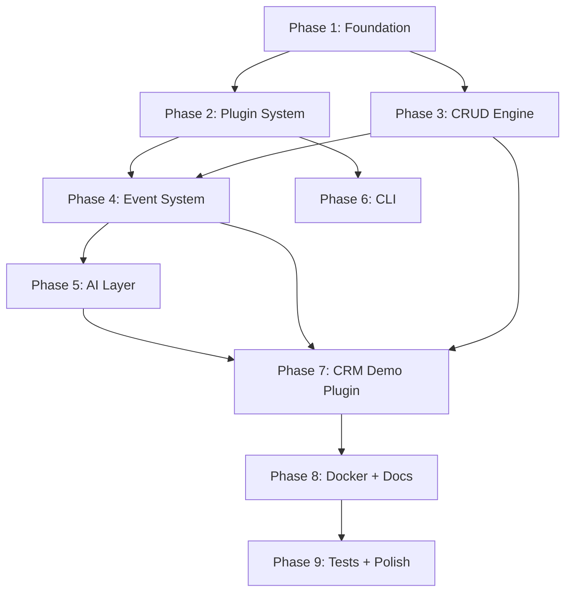

# Pravaah (NexusCore) — Complete Development Workflow

> **Timeline**: 3–4 days  
> **Stack**: FastAPI · SQLAlchemy · Pydantic · Typer · OpenAI  
> **Philosophy**: *"Everything flows."*  
> **Audience**: Solo developer building a portfolio-grade framework

---

## Table of Contents

1. [Dependency Graph](#dependency-graph)
2. [Pre-Work: Environment Setup](#pre-work-environment-setup)
3. [Day 1 — Foundation + Plugin System](#day-1--foundation--plugin-system)
4. [Day 2 — CRUD Engine + Event System](#day-2--crud-engine--event-system)
5. [Day 3 — AI Layer + CLI + CRM Demo Plugin](#day-3--ai-layer--cli--crm-demo-plugin)
6. [Day 4 — Docker, Docs, Tests, Polish](#day-4--docker-docs-tests-polish)
7. [Complete File Manifest](#complete-file-manifest)
8. [Internal Data Flows](#internal-data-flows)
9. [Git Commit Strategy](#git-commit-strategy)
10. [Risk Mitigation](#risk-mitigation)
11. [Final Delivery Checklist](#final-delivery-checklist)

---

## Dependency Graph

Phases MUST be executed in this topological order. Arrows = hard dependencies.



**Parallelization opportunities:**
- Phase 2 (Plugin) and Phase 3 (CRUD) can run in parallel after Phase 1.
- Phase 5 (AI) and Phase 6 (CLI) can run in parallel after Phase 4.

---

## Pre-Work: Environment Setup

Complete these steps before writing any framework code.

| # | Step | Command / Action |
|---|------|-----------------|
| 1 | Create virtual environment | `python -m venv .venv` |
| 2 | Activate venv | `.venv\Scripts\activate` |
| 3 | Initialize git | `git init && git checkout -b main` |
| 4 | Create `.gitignore` | See content below |
| 5 | Install core deps | `pip install fastapi uvicorn[standard] sqlalchemy aiosqlite pydantic pydantic-settings pyyaml typer[all] jinja2 openai httpx` |
| 6 | Install dev deps | `pip install pytest pytest-asyncio pytest-cov ruff httpx` |
| 7 | Freeze deps | `pip freeze > requirements.txt` |

### `.gitignore` content

```gitignore
__pycache__/
*.py[cod]
*.egg-info/
dist/
build/
.venv/
.env
*.db
*.sqlite3
.ruff_cache/
.pytest_cache/
.mypy_cache/
.idea/
.vscode/
*.log
```

### Verify environment

```bash
python -c "import fastapi; import sqlalchemy; import pydantic; print('All deps OK')"
```

---

## Day 1 — Foundation + Plugin System

**Goal**: A running FastAPI app that can discover, load, and register plugins.

---

### PHASE 1: Foundation (Core Infrastructure)

> Everything depends on this phase. Do not skip ahead.

---

#### Step 1.1 — Project Skeleton

Create every directory and `__init__.py` first. This prevents import errors later.

```
nexuscore/
├── __init__.py
├── app/
│   ├── __init__.py
│   ├── main.py
│   ├── core/
│   │   ├── __init__.py
│   │   ├── config.py
│   │   ├── database.py
│   │   ├── exceptions.py
│   │   ├── registry.py
│   │   └── security.py
│   ├── engine/
│   │   └── __init__.py
│   ├── events/
│   │   └── __init__.py
│   ├── plugins/
│   │   └── __init__.py
│   ├── ai/
│   │   ├── __init__.py
│   │   └── providers/
│   │       └── __init__.py
│   ├── middleware/
│   │   └── __init__.py
│   └── services/
│       └── __init__.py
├── cli/
│   ├── __init__.py
│   ├── commands/
│   │   └── __init__.py
│   └── templates/
│       └── plugin/
└── plugins/
    ├── __init__.py
    └── crm/
        └── __init__.py
config/
    └── (nexus.yaml — created in Step 1.2)
tests/
    └── __init__.py
docs/
```

**Verification:**
```bash
python -c "import nexuscore"
# Must complete with no errors
```

---

#### Step 1.2 — Configuration System

**Files:**
- `config/nexus.yaml`
- `nexuscore/app/core/config.py`

**`config/nexus.yaml`** — Default framework configuration:

```yaml
app:
  title: "NexusCore"
  description: "AI-ready modular backend framework"
  version: "0.1.0"
  debug: true
  host: "0.0.0.0"
  port: 8000

database:
  url: "sqlite+aiosqlite:///./nexuscore.db"
  echo: false

ai:
  enabled: false
  provider: "openai"
  model: "gpt-3.5-turbo"
  api_key: ""
  temperature: 0.7
  max_tokens: 1024

plugins:
  auto_discover: true
  paths:
    - "nexuscore/plugins"
```

**`nexuscore/app/core/config.py`** — Must implement:

| Class | Fields | Notes |
|-------|--------|-------|
| `AppConfig` | `title`, `description`, `version`, `debug`, `host`, `port` | All strings/ints with defaults |
| `DatabaseConfig` | `url`, `echo` | Default SQLite URL |
| `AIConfig` | `enabled`, `provider`, `model`, `api_key`, `temperature`, `max_tokens` | `enabled=False` by default |
| `PluginConfig` | `auto_discover`, `paths` | List of discovery paths |
| `NexusConfig` | `app`, `database`, `ai`, `plugins` | Nests all above; loads YAML first, then env vars with `NEXUS_` prefix |

**Key implementation detail — layered config loading:**
```python
# Pseudocode for config layering
1. Load config/nexus.yaml → base dict
2. Override with environment variables (NEXUS_APP__TITLE, NEXUS_DATABASE__URL, etc.)
3. Parse into NexusConfig Pydantic Settings model
```

**Verification:**
```python
from nexuscore.app.core.config import NexusConfig
config = NexusConfig()
assert config.app.title == "NexusCore"
assert "sqlite" in config.database.url
assert config.ai.enabled == False
print("Config OK")
```

---

#### Step 1.3 — Exception Hierarchy

**File:** `nexuscore/app/core/exceptions.py`

| Exception Class | HTTP Status | When to Raise |
|----------------|------------|---------------|
| `NexusCoreError` | 500 | Base — never raised directly |
| `ConfigError` | 500 | Bad YAML, missing required config |
| `PluginError` | 500 | Plugin fails to load, bad manifest |
| `CRUDError` | 400/404 | Record not found, validation failure |
| `AIServiceError` | 503 | AI provider unreachable, quota exceeded |

**Signatures:**
```python
class NexusCoreError(Exception):
    def __init__(self, message: str, status_code: int = 500, details: dict = None): ...

class ConfigError(NexusCoreError): ...      # status_code=500
class PluginError(NexusCoreError): ...      # status_code=500
class CRUDError(NexusCoreError): ...        # status_code=400
class AIServiceError(NexusCoreError): ...   # status_code=503
```

---

#### Step 1.4 — Database Layer

**File:** `nexuscore/app/core/database.py`

**Must implement:**

| Component | Signature / Description |
|-----------|------------------------|
| `Base` | Declarative base with mixin: `id` (Integer, PK, autoincrement), `created_at` (DateTime, server_default=now), `updated_at` (DateTime, onupdate=now) |
| `engine` | `create_async_engine(config.database.url)` |
| `async_session_factory` | `async_sessionmaker(engine, class_=AsyncSession, expire_on_commit=False)` |
| `get_db()` | Async generator dependency: `async def get_db() -> AsyncGenerator[AsyncSession, None]` |
| `init_db()` | `async def init_db()` — creates all tables from metadata |

**Important:** Use `aiosqlite` driver for async SQLite support. The connection URL format is `sqlite+aiosqlite:///./nexuscore.db`.

**Verification:**
```python
# Quick test script
import asyncio
from nexuscore.app.core.database import init_db, engine

async def test():
    await init_db()
    print("Database initialized OK")

asyncio.run(test())
```

---

#### Step 1.5 — Central Registry

**File:** `nexuscore/app/core/registry.py`

The registry is the **central nervous system** of NexusCore. Everything registers here.

**Must implement:**

| Method | Signature | Purpose |
|--------|-----------|---------|
| `register_plugin` | `(name: str, plugin: NexusPlugin) -> None` | Store plugin reference |
| `register_model` | `(name: str, model: type, schema: type) -> None` | Store model + schema pair |
| `register_routes` | `(router: APIRouter) -> None` | Collect routers for mounting |
| `register_hook` | `(event: str, handler: Callable) -> None` | Collect event handlers |
| `list_plugins` | `() -> dict[str, NexusPlugin]` | Return all registered plugins |
| `get_model` | `(name: str) -> type` | Lookup model by name |
| `get_routes` | `() -> list[APIRouter]` | Return all registered routers |

**Design:** Singleton pattern. Thread-safe. Initialized once at app startup.

```python
class NexusRegistry:
    _instance = None

    def __new__(cls):
        if cls._instance is None:
            cls._instance = super().__new__(cls)
            cls._instance._plugins = {}
            cls._instance._models = {}
            cls._instance._routes = []
            cls._instance._hooks = {}
        return cls._instance
```

---

#### Step 1.6 — Security Stub

**File:** `nexuscore/app/core/security.py`

This is a **stub** for the MVP. No real authentication.

```python
# Placeholder — to be expanded in future versions
async def get_current_user():
    """Returns None in MVP. Future: JWT / API key validation."""
    return None
```

---

#### Step 1.7 — Middleware Stack

Three middleware files, each handling one cross-cutting concern:

**File 1: `nexuscore/app/middleware/request_id.py`**

| What | Details |
|------|---------|
| Purpose | Attach a unique `X-Request-ID` UUID4 to every request/response |
| Implementation | Starlette `BaseHTTPMiddleware`; store ID in `contextvars.ContextVar` for downstream access |
| Output | Request ID available via `get_request_id()` function anywhere in the call stack |

**File 2: `nexuscore/app/middleware/logging.py`**

| What | Details |
|------|---------|
| Purpose | Log every request with structured JSON |
| Fields logged | `timestamp`, `method`, `path`, `status_code`, `duration_ms`, `request_id` |
| Implementation | Starlette `BaseHTTPMiddleware`; uses Python `logging` with custom JSON formatter |

**File 3: `nexuscore/app/middleware/error_handler.py`**

| What | Details |
|------|---------|
| Purpose | Catch all exceptions and return structured JSON error responses |
| `NexusCoreError` → | `{"error": message, "status_code": code, "request_id": id, "details": {...}}` |
| Unhandled Exception → | `{"error": "Internal Server Error", "status_code": 500, "request_id": id}` |

---

#### Step 1.8 — Health Check + App Factory

**File: `nexuscore/app/services/health.py`**

Single endpoint: `GET /health`

Response schema:
```json
{
    "status": "healthy",
    "version": "0.1.0",
    "database": "connected",
    "plugins_loaded": 0
}
```

**File: `nexuscore/app/main.py`** — THE HEART OF NEXUSCORE

**Must implement:**

```python
def create_app() -> FastAPI:
    """
    App factory function.
    
    Lifespan sequence:
    1. Load configuration (NexusConfig)
    2. Initialize database (init_db)
    3. Initialize registry (NexusRegistry)
    4. Load plugins (PluginLoader — Phase 2)
    5. Register middleware stack
    6. Mount health check router
    7. Mount all plugin-registered routers
    8. Configure OpenAPI metadata
    """
```

**Middleware registration order matters:**
```
1. RequestIDMiddleware    (first — generates ID for all downstream)
2. LoggingMiddleware      (second — logs with request ID)
3. ErrorHandlerMiddleware (third — catches errors from all below)
```

---

#### 🚦 GATE CHECK — Phase 1

**ALL of these must pass before proceeding:**

```bash
# 1. Server starts
uvicorn nexuscore.app.main:app --reload

# 2. Health check responds
curl http://localhost:8000/health
# Expected: {"status":"healthy","version":"0.1.0","database":"connected","plugins_loaded":0}

# 3. Swagger UI loads
# Open http://localhost:8000/docs in browser — should show OpenAPI UI

# 4. Request ID header present
curl -v http://localhost:8000/health 2>&1 | grep "x-request-id"
# Expected: x-request-id: <some-uuid>

# 5. Structured logs appear in terminal
# Expected: JSON log lines with method, path, status, duration
```

**Git checkpoint:**
```bash
git add -A
git commit -m "feat: initialize framework core — config, database, registry, middleware, app factory"
```

---

### PHASE 2: Plugin System

> Plugins are the primary extensibility mechanism. Everything else plugs into this.

---

#### Step 2.1 — Plugin Manifest

**File:** `nexuscore/app/plugins/manifest.py`

```python
class PluginManifest(BaseModel):
    name: str                          # e.g., "crm"
    version: str                       # e.g., "0.1.0"
    description: str = ""              # Human-readable description
    author: str = ""                   # Author name
    dependencies: list[str] = []       # Names of plugins this depends on
```

Bad manifests must fail fast with a clear `PluginError`.

---

#### Step 2.2 — Plugin Base Class

**File:** `nexuscore/app/plugins/base.py`

```python
class NexusPlugin(ABC):
    """Abstract base class every plugin must extend."""

    @property
    @abstractmethod
    def manifest(self) -> PluginManifest:
        """Return this plugin's manifest."""
        ...

    @abstractmethod
    async def setup(self, app: FastAPI, registry: NexusRegistry) -> None:
        """
        Called once when the plugin is loaded.
        Register models, routes, hooks here.
        """
        ...

    async def teardown(self) -> None:
        """Called on shutdown. Override for cleanup."""
        pass

    # Helper methods (non-abstract)
    def register_model(self, registry, name, model, schema): ...
    def register_routes(self, registry, router): ...
    def register_hook(self, registry, event, handler): ...
```

---

#### Step 2.3 — Plugin Loader

**File:** `nexuscore/app/plugins/loader.py`

**Loader workflow:**

```
1. Read plugin paths from config.plugins.paths
2. Scan each path for directories containing plugin.py
3. Import each plugin module via importlib
4. Find the NexusPlugin subclass in the module
5. Instantiate it, validate its manifest
6. Topological sort by manifest.dependencies
7. Call plugin.setup(app, registry) in dependency order
8. Log: "Loaded plugin: {name} v{version}"
```

**Key method signatures:**

| Method | Signature | Purpose |
|--------|-----------|---------|
| `discover` | `(paths: list[str]) -> list[type[NexusPlugin]]` | Find all plugin classes |
| `_topo_sort` | `(plugins: list[NexusPlugin]) -> list[NexusPlugin]` | Dependency ordering |
| `load_all` | `(app: FastAPI, registry: NexusRegistry) -> None` | Full load sequence |

**Error handling:**
- Missing dependency → `PluginError("Plugin 'x' depends on 'y' which is not installed")`
- Circular dependency → `PluginError("Circular dependency detected: x → y → x")`
- Bad manifest → `PluginError("Invalid manifest for plugin in path: ...")`

---

#### 🚦 GATE CHECK — Phase 2

Create a temporary dummy plugin to verify the loader:

```python
# nexuscore/plugins/dummy/__init__.py  (temporary — delete after test)
# nexuscore/plugins/dummy/plugin.py
class DummyPlugin(NexusPlugin):
    @property
    def manifest(self):
        return PluginManifest(name="dummy", version="0.1.0")

    async def setup(self, app, registry):
        registry.register_plugin("dummy", self)
```

```bash
uvicorn nexuscore.app.main:app --reload
# Logs should show: "Loaded plugin: dummy v0.1.0"
curl http://localhost:8000/health
# Expected: "plugins_loaded": 1
```

Delete the dummy plugin after verification.

**Git checkpoint:**
```bash
git add -A
git commit -m "feat: implement plugin system — manifest, base class, loader with dependency resolution"
```

---

## Day 2 — CRUD Engine + Event System

**Goal**: Auto-generate REST APIs from models; fire events on data changes.

---

### PHASE 3: Auto CRUD Engine

> Define a model once, get a full REST API for free.

---

#### Step 3.1 — Pagination

**File:** `nexuscore/app/engine/pagination.py`

**Must implement:**

```python
class PaginationParams:
    """FastAPI dependency for pagination query parameters."""
    def __init__(self, page: int = 1, page_size: int = 20):
        # page >= 1, page_size between 1-100
        ...

class PaginatedResponse(BaseModel, Generic[T]):
    items: list[T]
    total: int
    page: int
    page_size: int
    total_pages: int
```

---

#### Step 3.2 — CRUD Factory

**File:** `nexuscore/app/engine/crud.py`

The core productivity engine. Generic class that works with any SQLAlchemy model.

```python
class CRUDBase(Generic[ModelType, CreateSchemaType, UpdateSchemaType]):
    def __init__(self, model: type[ModelType]):
        self.model = model

    async def create(self, db: AsyncSession, obj_in: CreateSchemaType) -> ModelType: ...
    async def get(self, db: AsyncSession, id: int) -> ModelType | None: ...
    async def get_multi(self, db: AsyncSession, pagination: PaginationParams,
                         filters: dict = None, sort_by: str = None) -> PaginatedResponse: ...
    async def update(self, db: AsyncSession, id: int, obj_in: UpdateSchemaType) -> ModelType: ...
    async def delete(self, db: AsyncSession, id: int) -> bool: ...
```

**Event dispatch integration (lazy — stubs for now, wired in Phase 4):**

```python
async def create(self, db, obj_in):
    # 1. Validate input
    # 2. Create SQLAlchemy model instance
    # 3. db.add(instance) + db.commit()
    # 4. dispatch("on_create:{model_name}", instance)  ← STUB for now
    # 5. Return instance
```

**Error handling:**
- `get()` returns `None` if not found (caller decides to raise or not)
- `update()` / `delete()` raise `CRUDError("Record not found", status_code=404)` if ID doesn't exist

---

#### Step 3.3 — Router Factory

**File:** `nexuscore/app/engine/router_factory.py`

Auto-generates a complete FastAPI router for any model.

```python
def create_crud_router(
    model: type,
    create_schema: type,
    update_schema: type,
    read_schema: type,
    prefix: str,           # e.g., "/customers"
    tags: list[str] = None # e.g., ["CRM"]
) -> APIRouter:
```

**Generated endpoints:**

| Method | Path | Status | Description |
|--------|------|--------|-------------|
| `POST` | `/` | 201 | Create a new record |
| `GET` | `/` | 200 | List records (paginated) |
| `GET` | `/{id}` | 200 | Get single record by ID |
| `PUT` | `/{id}` | 200 | Update record by ID |
| `DELETE` | `/{id}` | 204 | Delete record by ID |

Each endpoint:
- Has proper OpenAPI summary/description
- Uses correct response_model
- Injects `db` session via `Depends(get_db)`
- Returns proper HTTP status codes
- Handles `CRUDError` for 404s

---

#### 🚦 GATE CHECK — Phase 3

Create a quick test model to verify auto-CRUD works:

```python
# Temporary test in main.py or a scratch script
from nexuscore.app.engine.router_factory import create_crud_router
# Register a test model, start server, check /docs for endpoints
```

```bash
uvicorn nexuscore.app.main:app --reload
# Open /docs — test model CRUD endpoints should be visible
```

**Git checkpoint:**
```bash
git add -A
git commit -m "feat: add dynamic CRUD engine — generic CRUD factory, router factory, pagination"
```

---

### PHASE 4: Event System

> Enables loose coupling between plugins and cross-cutting concerns.

---

#### Step 4.1 — Event Dispatcher

**File:** `nexuscore/app/events/dispatcher.py`

**Must implement:**

```python
class EventDispatcher:
    """Singleton event bus. Supports sync and async handlers."""
    _instance = None

    def register(self, event_name: str, handler: Callable, priority: int = 0) -> None:
        """Register a handler for an event. Lower priority = called first."""
        ...

    async def dispatch(self, event_name: str, payload: Any = None) -> None:
        """
        Fire an event. Call all handlers in priority order.
        - Async handlers: awaited directly
        - Sync handlers: auto-wrapped in asyncio.to_thread()
        - Error isolation: one handler's failure is logged, doesn't block others
        """
        ...

    def list_events(self) -> dict[str, list]:
        """Introspection: return all registered events and their handler counts."""
        ...
```

**Built-in event names (convention):**

| Event Pattern | Fired When |
|--------------|-----------|
| `on_create:{ModelName}` | After a new record is created |
| `on_update:{ModelName}` | After a record is updated |
| `on_delete:{ModelName}` | After a record is deleted |
| `before_save:{ModelName}` | Before create or update (can modify data) |
| `after_save:{ModelName}` | After create or update (read-only) |
| `on_startup` | When the app starts |
| `on_shutdown` | When the app shuts down |

---

#### Step 4.2 — Event Decorators

**File:** `nexuscore/app/events/decorators.py`

Sugar for registering event handlers:

```python
def on_create(model_name: str):
    """Decorator: register handler for on_create:{model_name} event."""
    def decorator(func):
        # Store in a pending list; registered when plugin.setup() is called
        _pending_handlers.append(("on_create:" + model_name, func))
        return func
    return decorator

def on_update(model_name: str): ...
def on_delete(model_name: str): ...
def on_event(event_name: str): ...   # Generic — any event name
```

**Deferred registration pattern:**
Decorators run at import time, but the dispatcher may not exist yet. Solution: collect handlers in a module-level list, then flush them into the dispatcher when the plugin loads.

---

#### Step 4.3 — Wire Events into CRUD Engine

Go back to `nexuscore/app/engine/crud.py` and replace the stub comments with real dispatch calls:

```python
# In CRUDBase.create():
await EventDispatcher().dispatch(f"on_create:{self.model.__name__}", new_obj)

# In CRUDBase.update():
await EventDispatcher().dispatch(f"on_update:{self.model.__name__}", updated_obj)

# In CRUDBase.delete():
await EventDispatcher().dispatch(f"on_delete:{self.model.__name__}", {"id": id})
```

---

#### 🚦 GATE CHECK — Phase 4

```python
# Quick verification script
import asyncio
from nexuscore.app.events.dispatcher import EventDispatcher

async def test_events():
    dispatcher = EventDispatcher()
    results = []

    async def handler(payload):
        results.append(payload)

    dispatcher.register("on_create:TestModel", handler)
    await dispatcher.dispatch("on_create:TestModel", {"id": 1, "name": "test"})

    assert len(results) == 1
    assert results[0]["id"] == 1
    print("Events OK")

asyncio.run(test_events())
```

**Git checkpoint:**
```bash
git add -A
git commit -m "feat: integrate event system — dispatcher, decorators, CRUD event hooks"
```

---

## Day 3 — AI Layer + CLI + CRM Demo Plugin

**Goal**: AI integration working; CLI usable; CRM plugin proves the framework end-to-end.

---

### PHASE 5: AI Service Layer

> First-class AI integration differentiates NexusCore from traditional frameworks.

---

#### Step 5.1 — AI Provider Abstraction

**File:** `nexuscore/app/ai/providers/base.py`

```python
@dataclass
class AIResponse:
    text: str
    model: str
    usage: dict        # {"prompt_tokens": N, "completion_tokens": N}
    metadata: dict = field(default_factory=dict)

class AIProvider(ABC):
    @abstractmethod
    async def complete(self, prompt: str, **kwargs) -> AIResponse: ...

    @abstractmethod
    async def summarize(self, text: str) -> AIResponse: ...

    @abstractmethod
    async def generate(self, template: str, context: dict) -> AIResponse: ...
```

**File:** `nexuscore/app/ai/providers/openai.py`

```python
class OpenAIProvider(AIProvider):
    def __init__(self, api_key: str, model: str = "gpt-3.5-turbo",
                 temperature: float = 0.7, max_tokens: int = 1024):
        self.client = AsyncOpenAI(api_key=api_key)
        ...

    async def complete(self, prompt, **kwargs) -> AIResponse:
        # Uses openai async client
        # Retry with exponential backoff (3 attempts)
        # Graceful error handling → AIServiceError
        ...
```

**Mock provider (for development without API key):**

```python
class MockProvider(AIProvider):
    """Returns canned responses. Use for dev/testing."""
    async def complete(self, prompt, **kwargs):
        return AIResponse(text="[Mock AI response]", model="mock", usage={})
    async def summarize(self, text):
        return AIResponse(text=f"Summary of: {text[:50]}...", model="mock", usage={})
    async def generate(self, template, context):
        return AIResponse(text=f"Generated from template: {template}", model="mock", usage={})
```

---

#### Step 5.2 — Prompt Templates

**File:** `nexuscore/app/ai/templates.py`

```python
class PromptTemplate:
    def __init__(self, name: str, template: str):
        self.name = name
        self.template = template   # Jinja2 format with {{ variables }}

    def render(self, **context) -> str:
        """Render template with given context variables."""
        ...

# Built-in templates
BUILTIN_TEMPLATES = {
    "summarize": PromptTemplate(
        name="summarize",
        template="Summarize the following data concisely:\n\n{{ data }}"
    ),
    "extract_entities": PromptTemplate(
        name="extract_entities",
        template="Extract key entities from:\n\n{{ text }}\n\nReturn as JSON."
    ),
    "generate_report": PromptTemplate(
        name="generate_report",
        template="Generate a {{ report_type }} report for:\n\n{{ data }}"
    ),
}
```

---

#### Step 5.3 — AI Service Facade

**File:** `nexuscore/app/ai/service.py`

The single entry point plugins use for AI:

```python
class AIService:
    def __init__(self, config: AIConfig):
        if config.enabled:
            self.provider = self._create_provider(config)
        else:
            self.provider = None

    async def generate_summary(self, data: str) -> str | None:
        """Generate a summary. Returns None if AI is disabled."""
        if not self.provider:
            logger.warning("AI is disabled. Returning None.")
            return None
        response = await self.provider.summarize(data)
        return response.text

    async def generate_report(self, data: str, template: str = "generate_report") -> str | None: ...
    async def complete(self, prompt: str) -> str | None: ...

    def _create_provider(self, config) -> AIProvider:
        """Factory: create provider based on config.provider string."""
        providers = {"openai": OpenAIProvider, "mock": MockProvider}
        ...
```

**FastAPI dependency:**
```python
async def get_ai_service() -> AIService:
    config = NexusConfig()
    return AIService(config.ai)
```

**Git checkpoint:**
```bash
git add -A
git commit -m "feat: integrate AI orchestration layer — provider abstraction, prompt templates, service facade"
```

---

### PHASE 6: CLI Tooling

> Developer experience. A great CLI makes the framework feel professional.

---

#### Step 6.1 — CLI Entry Point

**File:** `nexuscore/cli/main.py`

```python
import typer
app = typer.Typer(name="nexus", help="NexusCore Framework CLI")

# Import and register sub-command groups
from nexuscore.cli.commands import run, plugin, model
app.command()(run.run)
app.command("create-plugin")(plugin.create_plugin)
app.command("list-plugins")(plugin.list_plugins)
app.command("create-model")(model.create_model)

if __name__ == "__main__":
    app()
```

---

#### Step 6.2 — CLI Commands

**File:** `nexuscore/cli/commands/run.py`

```python
def run(host: str = "0.0.0.0", port: int = 8000, reload: bool = True, config: str = "config/nexus.yaml"):
    """Start the NexusCore development server."""
    import uvicorn
    uvicorn.run("nexuscore.app.main:app", host=host, port=port, reload=reload)
```

**File:** `nexuscore/cli/commands/plugin.py`

```python
def create_plugin(name: str):
    """Scaffold a new plugin from templates."""
    # 1. Create nexuscore/plugins/{name}/ directory
    # 2. Render Jinja2 templates: __init__.py, plugin.py, models.py, routes.py
    # 3. Print success message with next steps

def list_plugins():
    """Discover and list all available plugins."""
    # 1. Scan plugin directories
    # 2. Import each, read manifest
    # 3. Print table: name, version, description
```

**File:** `nexuscore/cli/commands/model.py`

```python
def create_model(plugin: str, model: str):
    """Scaffold a new model inside an existing plugin."""
    # 1. Verify plugin directory exists
    # 2. Render model.py.j2 template
    # 3. Append import to plugin's models.py
    # 4. Print success message
```

---

#### Step 6.3 — Jinja2 Scaffolding Templates

**File:** `nexuscore/cli/templates/plugin/__init__.py.j2`
```python
# {{ plugin_name }} plugin for NexusCore
```

**File:** `nexuscore/cli/templates/plugin/plugin.py.j2`
```python
from nexuscore.app.plugins.base import NexusPlugin
from nexuscore.app.plugins.manifest import PluginManifest

class {{ plugin_class_name }}(NexusPlugin):
    @property
    def manifest(self):
        return PluginManifest(name="{{ plugin_name }}", version="0.1.0")

    async def setup(self, app, registry):
        pass
```

**File:** `nexuscore/cli/templates/plugin/models.py.j2`
```python
from nexuscore.app.core.database import Base
# Define your SQLAlchemy models here
```

**File:** `nexuscore/cli/templates/plugin/routes.py.j2`
```python
from fastapi import APIRouter
router = APIRouter(prefix="/{{ plugin_name }}", tags=["{{ plugin_name }}"])
```

**File:** `nexuscore/cli/templates/model.py.j2`
```python
from sqlalchemy import Column, Integer, String, DateTime
from nexuscore.app.core.database import Base

class {{ model_name }}(Base):
    __tablename__ = "{{ table_name }}"
    id = Column(Integer, primary_key=True, autoincrement=True)
    # Add your columns here
```

---

#### 🚦 GATE CHECK — Phase 6

```bash
python -m nexuscore.cli.main --help
# Expected: Shows nexus CLI with all commands

python -m nexuscore.cli.main run --help
# Expected: Shows --host, --port, --reload, --config options

python -m nexuscore.cli.main create-plugin inventory
# Expected: Creates nexuscore/plugins/inventory/ with scaffolded files
# Verify the files exist and have correct content, then delete the test plugin
```

**Git checkpoint:**
```bash
git add -A
git commit -m "feat: add CLI tooling — run, create-plugin, create-model, list-plugins commands"
```

---

### PHASE 7: CRM Demo Plugin

> **This is the showcase.** It proves the framework works end-to-end. Every prior phase converges here.

---

#### Step 7.1 — Plugin Registration

**File:** `nexuscore/plugins/crm/plugin.py`

```python
class CRMPlugin(NexusPlugin):
    @property
    def manifest(self):
        return PluginManifest(
            name="crm",
            version="0.1.0",
            description="Customer Relationship Management plugin",
            author="Shreeji"
        )

    async def setup(self, app, registry):
        # 1. Register models: Customer, Lead
        # 2. Create CRUD routers for both models
        # 3. Register custom routes (dashboard, AI endpoints)
        # 4. Register event hooks
        # 5. Register all routers with registry
```

---

#### Step 7.2 — SQLAlchemy Models

**File:** `nexuscore/plugins/crm/models.py`

**Customer model:**

| Column | Type | Constraints |
|--------|------|------------|
| `id` | Integer | PK, autoincrement |
| `name` | String(100) | NOT NULL |
| `email` | String(255) | UNIQUE, NOT NULL |
| `phone` | String(20) | nullable |
| `company` | String(100) | nullable |
| `status` | String(20) | default="active" |
| `notes` | Text | nullable |
| `created_at` | DateTime | server_default=now |
| `updated_at` | DateTime | onupdate=now |

**Lead model:**

| Column | Type | Constraints |
|--------|------|------------|
| `id` | Integer | PK, autoincrement |
| `name` | String(100) | NOT NULL |
| `email` | String(255) | NOT NULL |
| `source` | String(50) | e.g., "website", "referral" |
| `status` | String(20) | default="new" |
| `score` | Integer | default=0 |
| `assigned_to` | String(100) | nullable |
| `created_at` | DateTime | server_default=now |
| `updated_at` | DateTime | onupdate=now |

---

#### Step 7.3 — Pydantic Schemas

**File:** `nexuscore/plugins/crm/schemas.py`

| Schema | Fields | Validations |
|--------|--------|-------------|
| `CustomerCreate` | name, email, phone, company, notes | email format, name max 100 chars |
| `CustomerUpdate` | All optional versions of above | Same validations |
| `CustomerRead` | All fields + id, created_at, updated_at | `model_config = ConfigDict(from_attributes=True)` |
| `LeadCreate` | name, email, source, assigned_to | email format |
| `LeadUpdate` | All optional + score, status | score 0-100 |
| `LeadRead` | All fields + id, created_at, updated_at | `from_attributes=True` |

---

#### Step 7.4 — Custom Routes

**File:** `nexuscore/plugins/crm/routes.py`

Beyond auto-CRUD, the CRM adds these custom endpoints:

| Method | Path | Purpose | Uses |
|--------|------|---------|------|
| `POST` | `/customers/{id}/summarize` | AI-generated customer summary | AIService |
| `GET` | `/crm/dashboard` | Basic CRM stats | Direct DB query |

**Dashboard response:**
```json
{
    "total_customers": 42,
    "total_leads": 18,
    "leads_by_status": {"new": 5, "contacted": 8, "qualified": 5},
    "recent_customers": [...]
}
```

---

#### Step 7.5 — Event Hooks

**File:** `nexuscore/plugins/crm/hooks.py`

```python
from nexuscore.app.events.decorators import on_create, on_update

@on_create("Customer")
async def log_new_customer(customer):
    """Log when a new customer is created."""
    logger.info(f"New customer created: {customer.name} ({customer.email})")

@on_update("Lead")
async def recalculate_lead_score(lead):
    """Recalculate lead score when lead data changes."""
    # Simple scoring logic based on completeness
    score = 0
    if lead.email: score += 20
    if lead.source: score += 20
    if lead.assigned_to: score += 30
    if lead.status == "qualified": score += 30
    # Update score...
```

---

#### Step 7.6 — CRM Service Layer

**File:** `nexuscore/plugins/crm/services.py`

```python
class CRMService:
    def __init__(self, ai_service: AIService):
        self.ai = ai_service

    async def generate_customer_summary(self, customer) -> str:
        """Use AI to generate a natural language summary of a customer."""
        data = f"Customer: {customer.name}, Email: {customer.email}, "
        data += f"Company: {customer.company}, Status: {customer.status}, "
        data += f"Notes: {customer.notes}"
        return await self.ai.generate_summary(data)

    def calculate_lead_score(self, lead) -> int:
        """Calculate a lead quality score (0-100)."""
        score = 0
        if lead.email: score += 20
        if lead.source: score += 20
        if lead.assigned_to: score += 30
        if lead.status in ("qualified", "converted"): score += 30
        return min(score, 100)
```

---

#### 🚦 GATE CHECK — Phase 7 (CRITICAL — Full End-to-End Validation)

This is the **most important gate check**. Every prior phase converges here.

```bash
uvicorn nexuscore.app.main:app --reload
```

**Test Matrix:**

| # | Test | Command | Expected Result |
|---|------|---------|----------------|
| 1 | Plugin loads | Check startup logs | `Loaded plugin: crm v0.1.0` |
| 2 | Create customer | `POST /api/crm/customers` with `{"name":"John","email":"john@test.com"}` | 201 Created |
| 3 | List customers | `GET /api/crm/customers` | `{"items":[...],"total":1,"page":1}` |
| 4 | Get customer | `GET /api/crm/customers/1` | Customer JSON |
| 5 | Update customer | `PUT /api/crm/customers/1` with `{"company":"Acme"}` | Updated customer |
| 6 | Create lead | `POST /api/crm/leads` with `{"name":"Jane","email":"jane@test.com","source":"website"}` | 201 Created |
| 7 | Events fire | Create customer, check terminal logs | `on_create:Customer` handler logged |
| 8 | AI summary | `POST /api/crm/customers/1/summarize` | AI text or mock response |
| 9 | Dashboard | `GET /api/crm/dashboard` | Stats JSON |
| 10 | Delete | `DELETE /api/crm/customers/1` | 204 No Content |
| 11 | Swagger | Open `/docs` | All CRM + CRUD endpoints visible |

**Git checkpoint:**
```bash
git add -A
git commit -m "feat: add CRM demo plugin — full end-to-end CRUD, events, AI integration"
```

---

## Day 4 — Docker, Docs, Tests, Polish

**Goal**: Production-ready packaging, comprehensive documentation, full test coverage.

---

### PHASE 8: Docker + Docs

---

#### Step 8.1 — Containerization

**File:** `Dockerfile`

```dockerfile
# Stage 1: Builder
FROM python:3.11-slim AS builder
WORKDIR /app
COPY requirements.txt .
RUN pip install --no-cache-dir --user -r requirements.txt

# Stage 2: Runtime
FROM python:3.11-slim
WORKDIR /app
COPY --from=builder /root/.local /root/.local
COPY . .
ENV PATH=/root/.local/bin:$PATH

# Non-root user
RUN useradd -m nexus && chown -R nexus:nexus /app
USER nexus

EXPOSE 8000
HEALTHCHECK CMD curl -f http://localhost:8000/health || exit 1
CMD ["uvicorn", "nexuscore.app.main:app", "--host", "0.0.0.0", "--port", "8000"]
```

**File:** `docker-compose.yml`

```yaml
version: "3.9"
services:
  nexuscore:
    build: .
    ports:
      - "8000:8000"
    volumes:
      - ./config:/app/config
      - ./nexuscore/plugins:/app/nexuscore/plugins
    env_file:
      - .env
    restart: unless-stopped
```

**File:** `.env.example`

```env
NEXUS_APP__DEBUG=true
NEXUS_DATABASE__URL=sqlite+aiosqlite:///./nexuscore.db
NEXUS_AI__ENABLED=false
NEXUS_AI__PROVIDER=mock
NEXUS_AI__API_KEY=your-openai-key-here
```

---

#### Step 8.2 — Project Metadata

**File:** `pyproject.toml`

```toml
[build-system]
requires = ["setuptools>=68.0", "wheel"]
build-backend = "setuptools.build_meta"

[project]
name = "nexuscore"
version = "0.1.0"
description = "AI-ready modular backend framework"
requires-python = ">=3.11"

[project.scripts]
nexus = "nexuscore.cli.main:app"
```

**File:** `requirements.txt` — Pin production deps

```text
fastapi>=0.104.0
uvicorn[standard]>=0.24.0
sqlalchemy>=2.0.0
aiosqlite>=0.19.0
pydantic>=2.0.0
pydantic-settings>=2.0.0
pyyaml>=6.0
typer[all]>=0.9.0
jinja2>=3.1.0
openai>=1.0.0
httpx>=0.25.0
```

**File:** `requirements-dev.txt`

```text
-r requirements.txt
pytest>=7.4.0
pytest-asyncio>=0.21.0
pytest-cov>=4.1.0
httpx>=0.25.0
ruff>=0.1.0
```

---

#### Step 8.3 — Documentation

**File:** `README.md` — Must include:

| Section | Content |
|---------|---------|
| Header | Project name, tagline, badges |
| Overview | Vision, philosophy ("Everything flows.") |
| Architecture | Mermaid diagram of request flow |
| Features | Bullet list: plugin system, auto-CRUD, events, AI, CLI |
| Quick Start | Install → Configure → Run (5 commands) |
| Plugin Development | How to create a custom plugin |
| API Examples | curl commands for CRUD operations |
| CLI Reference | Table of all commands |
| Technology Stack | Table of libs + versions |
| Roadmap | Future: PostgreSQL, auth, distributed events |

**File:** `docs/architecture.md`

- High-level architecture Mermaid diagram
- Request flow diagram (Client → FastAPI → Middleware → Plugin Router → CRUD → Events → DB)
- Plugin lifecycle diagram
- Component interaction table

**File:** `docs/getting-started.md`

Step-by-step guide:
1. Clone repository
2. Create virtual environment
3. Install dependencies
4. Configure `nexus.yaml`
5. Start the server
6. Create your first plugin
7. Add a model
8. Test your API

**Git checkpoint:**
```bash
git add -A
git commit -m "feat: add Docker, project metadata, and documentation"
```

---

### PHASE 9: Tests + Polish

---

#### Step 9.1 — Test Infrastructure

**File:** `tests/conftest.py`

```python
import pytest
import pytest_asyncio
from httpx import AsyncClient, ASGITransport
from sqlalchemy.ext.asyncio import create_async_engine, async_sessionmaker, AsyncSession

@pytest_asyncio.fixture
async def test_db():
    """In-memory SQLite database for tests."""
    engine = create_async_engine("sqlite+aiosqlite:///:memory:")
    # Create all tables
    # Yield session
    # Cleanup

@pytest_asyncio.fixture
async def test_app(test_db):
    """FastAPI app configured for testing."""
    from nexuscore.app.main import create_app
    app = create_app()
    # Override get_db dependency to use test_db
    yield app

@pytest_asyncio.fixture
async def client(test_app):
    """Async HTTP client for testing."""
    transport = ASGITransport(app=test_app)
    async with AsyncClient(transport=transport, base_url="http://test") as client:
        yield client
```

---

#### Step 9.2 — Unit Tests

**File:** `tests/test_crud_engine.py`

| Test | What it verifies |
|------|-----------------|
| `test_create_record` | CRUDBase.create() returns valid model instance |
| `test_get_record` | CRUDBase.get() returns correct record by ID |
| `test_get_nonexistent` | CRUDBase.get() returns None for missing ID |
| `test_list_records` | CRUDBase.get_multi() returns paginated list |
| `test_pagination` | Page 2 returns correct offset of records |
| `test_update_record` | CRUDBase.update() modifies and returns record |
| `test_update_nonexistent` | CRUDBase.update() raises CRUDError for missing ID |
| `test_delete_record` | CRUDBase.delete() removes record, returns True |
| `test_delete_nonexistent` | CRUDBase.delete() raises CRUDError for missing ID |

**File:** `tests/test_event_system.py`

| Test | What it verifies |
|------|-----------------|
| `test_register_handler` | Handler is stored for event name |
| `test_dispatch_event` | Handler receives correct payload |
| `test_multiple_handlers` | All handlers for same event are called |
| `test_priority_ordering` | Lower priority handlers run first |
| `test_error_isolation` | Failing handler doesn't block others |
| `test_async_handler` | Async handlers are awaited correctly |
| `test_sync_handler` | Sync handlers are auto-wrapped and called |

**File:** `tests/test_plugin_loader.py`

| Test | What it verifies |
|------|-----------------|
| `test_discover_plugins` | Loader finds plugins in specified paths |
| `test_load_plugin` | Plugin.setup() is called successfully |
| `test_manifest_validation` | Bad manifest raises PluginError |
| `test_dependency_ordering` | Plugins load in dependency order |
| `test_missing_dependency` | Missing dep raises PluginError with clear message |
| `test_circular_dependency` | Circular dep raises PluginError |

---

#### Step 9.3 — Integration Tests

**File:** `tests/test_crm_plugin.py`

| Test | What it verifies |
|------|-----------------|
| `test_create_customer` | POST /api/crm/customers → 201, returns customer JSON |
| `test_list_customers` | GET /api/crm/customers → 200, paginated response |
| `test_get_customer` | GET /api/crm/customers/1 → 200, correct data |
| `test_update_customer` | PUT /api/crm/customers/1 → 200, updated fields |
| `test_delete_customer` | DELETE /api/crm/customers/1 → 204 |
| `test_create_lead` | POST /api/crm/leads → 201 |
| `test_dashboard` | GET /api/crm/dashboard → 200, stats JSON |
| `test_ai_summary` | POST /api/crm/customers/1/summarize → 200, text response |
| `test_event_hooks_fire` | Create customer → verify hook side effects |
| `test_health_shows_plugins` | GET /health → plugins_loaded >= 1 |

---

#### 🚦 GATE CHECK — Phase 9

```bash
# Run full test suite
pytest tests/ -v --asyncio-mode=auto

# Run with coverage report
pytest tests/ --cov=nexuscore --cov-report=term-missing

# Lint the entire codebase
ruff check nexuscore/

# Expected: all tests pass, coverage > 70%, no lint errors
```

**Git checkpoint:**
```bash
git add -A
git commit -m "test: add comprehensive test suite — unit, integration, and plugin tests"
```

---

## Complete File Manifest

Every file in the final project, grouped by component:

### Framework Core (14 files)

| File | Phase | Purpose |
|------|-------|---------|
| `nexuscore/__init__.py` | 1 | Version + public re-exports |
| `nexuscore/app/__init__.py` | 1 | Package marker |
| `nexuscore/app/main.py` | 1 | App factory + lifespan |
| `nexuscore/app/core/__init__.py` | 1 | Package marker |
| `nexuscore/app/core/config.py` | 1 | Config system |
| `nexuscore/app/core/database.py` | 1 | Async SQLAlchemy setup |
| `nexuscore/app/core/exceptions.py` | 1 | Exception hierarchy |
| `nexuscore/app/core/registry.py` | 1 | Central registry |
| `nexuscore/app/core/security.py` | 1 | Auth stub |
| `nexuscore/app/middleware/__init__.py` | 1 | Package marker |
| `nexuscore/app/middleware/error_handler.py` | 1 | Error → JSON |
| `nexuscore/app/middleware/request_id.py` | 1 | Request ID injection |
| `nexuscore/app/middleware/logging.py` | 1 | Structured logging |
| `nexuscore/app/services/health.py` | 1 | Health endpoint |

### Plugin System (3 files)

| File | Phase | Purpose |
|------|-------|---------|
| `nexuscore/app/plugins/manifest.py` | 2 | Manifest schema |
| `nexuscore/app/plugins/base.py` | 2 | NexusPlugin ABC |
| `nexuscore/app/plugins/loader.py` | 2 | Plugin discovery + loading |

### CRUD Engine (3 files)

| File | Phase | Purpose |
|------|-------|---------|
| `nexuscore/app/engine/pagination.py` | 3 | Pagination schema + dep |
| `nexuscore/app/engine/crud.py` | 3 | Generic CRUD factory |
| `nexuscore/app/engine/router_factory.py` | 3 | Auto router generation |

### Event System (2 files)

| File | Phase | Purpose |
|------|-------|---------|
| `nexuscore/app/events/dispatcher.py` | 4 | Event bus |
| `nexuscore/app/events/decorators.py` | 4 | @on_create etc. |

### AI Layer (4 files)

| File | Phase | Purpose |
|------|-------|---------|
| `nexuscore/app/ai/providers/base.py` | 5 | AIProvider ABC |
| `nexuscore/app/ai/providers/openai.py` | 5 | OpenAI + Mock providers |
| `nexuscore/app/ai/templates.py` | 5 | Prompt templates |
| `nexuscore/app/ai/service.py` | 5 | AI service facade |

### CLI (8 files)

| File | Phase | Purpose |
|------|-------|---------|
| `nexuscore/cli/main.py` | 6 | Typer entry point |
| `nexuscore/cli/commands/run.py` | 6 | `nexus run` |
| `nexuscore/cli/commands/plugin.py` | 6 | `nexus create-plugin`, `list-plugins` |
| `nexuscore/cli/commands/model.py` | 6 | `nexus create-model` |
| `nexuscore/cli/templates/plugin/__init__.py.j2` | 6 | Template |
| `nexuscore/cli/templates/plugin/plugin.py.j2` | 6 | Template |
| `nexuscore/cli/templates/plugin/models.py.j2` | 6 | Template |
| `nexuscore/cli/templates/plugin/routes.py.j2` | 6 | Template |

### CRM Demo Plugin (7 files)

| File | Phase | Purpose |
|------|-------|---------|
| `nexuscore/plugins/crm/__init__.py` | 7 | Package marker |
| `nexuscore/plugins/crm/plugin.py` | 7 | CRM plugin class |
| `nexuscore/plugins/crm/models.py` | 7 | Customer + Lead models |
| `nexuscore/plugins/crm/schemas.py` | 7 | Pydantic schemas |
| `nexuscore/plugins/crm/routes.py` | 7 | Custom endpoints |
| `nexuscore/plugins/crm/hooks.py` | 7 | Event handlers |
| `nexuscore/plugins/crm/services.py` | 7 | Business logic |

### Infrastructure (10 files)

| File | Phase | Purpose |
|------|-------|---------|
| `config/nexus.yaml` | 1 | Default config |
| `Dockerfile` | 8 | Container build |
| `docker-compose.yml` | 8 | Container orchestration |
| `.env.example` | 8 | Env var template |
| `pyproject.toml` | 8 | Project metadata |
| `requirements.txt` | Pre | Production deps |
| `requirements-dev.txt` | 8 | Dev deps |
| `.gitignore` | Pre | Git ignores |
| `README.md` | 8 | Project docs |
| `docs/architecture.md` | 8 | Architecture docs |

### Tests (5 files)

| File | Phase | Purpose |
|------|-------|---------|
| `tests/conftest.py` | 9 | Shared fixtures |
| `tests/test_crud_engine.py` | 9 | CRUD unit tests |
| `tests/test_event_system.py` | 9 | Event unit tests |
| `tests/test_plugin_loader.py` | 9 | Plugin unit tests |
| `tests/test_crm_plugin.py` | 9 | CRM integration tests |

**Total: ~56 files**

---

## Internal Data Flows

### Flow 1: Request Lifecycle

```
Client HTTP Request
    │
    ▼
FastAPI receives request
    │
    ▼
RequestIDMiddleware
    ├── Generate UUID4
    ├── Set X-Request-ID header
    └── Store in ContextVar
    │
    ▼
LoggingMiddleware
    ├── Record start time
    └── (after response) Log: method, path, status, duration, request_id
    │
    ▼
ErrorHandlerMiddleware
    ├── try: pass to next handler
    ├── except NexusCoreError: return structured JSON
    └── except Exception: return 500 with request_id
    │
    ▼
FastAPI Route Handler
    ├── Depends(get_db) → AsyncSession
    ├── Depends(get_ai_service) → AIService (if needed)
    ├── CRUDBase operations
    └── Return response model
    │
    ▼
Response flows back through middleware (logging captures status + duration)
    │
    ▼
Client receives JSON response with X-Request-ID header
```

### Flow 2: Plugin Load Lifecycle

```
create_app() called
    │
    ▼
NexusConfig loaded
    │
    ▼
init_db() — create tables
    │
    ▼
NexusRegistry() — singleton initialized
    │
    ▼
PluginLoader.load_all()
    │
    ├── Scan config.plugins.paths
    ├── For each directory:
    │   ├── Import plugin.py module
    │   ├── Find NexusPlugin subclass
    │   ├── Instantiate it
    │   └── Validate manifest
    ├── Topological sort by dependencies
    └── For each plugin (in order):
        ├── plugin.setup(app, registry)
        │   ├── Register models → registry._models
        │   ├── Create CRUD routers → registry._routes
        │   ├── Register hooks → registry._hooks
        │   └── Register custom routes → registry._routes
        └── Log: "Loaded plugin: {name} v{version}"
    │
    ▼
Mount all registered routers on the FastAPI app
    │
    ▼
App ready to serve requests
```

### Flow 3: CRUD + Event Flow

```
POST /api/crm/customers  {name, email, ...}
    │
    ▼
router_factory endpoint handler
    │
    ▼
CRUDBase.create(db, customer_data)
    ├── Validate via Pydantic schema
    ├── Create SQLAlchemy model instance
    ├── db.add(instance)
    ├── db.commit()
    ├── db.refresh(instance)
    ├── dispatch("on_create:Customer", instance)
    │       │
    │       ▼
    │   EventDispatcher.dispatch()
    │       ├── Find handlers for "on_create:Customer"
    │       ├── Sort by priority
    │       └── For each handler:
    │           ├── If async: await handler(instance)
    │           ├── If sync: await to_thread(handler, instance)
    │           └── If error: log warning, continue to next
    │
    └── Return created instance
    │
    ▼
FastAPI serializes via response_model (CustomerRead)
    │
    ▼
201 Created + JSON response
```

### Flow 4: AI Summary Flow

```
POST /api/crm/customers/1/summarize
    │
    ▼
Custom route handler in crm/routes.py
    │
    ▼
CRUDBase.get(db, id=1) → Customer object
    │
    ▼
CRMService.generate_customer_summary(customer)
    │
    ▼
AIService.generate_summary(data_string)
    │
    ├── If AI disabled: return None, log warning
    └── If AI enabled:
        │
        ▼
    AIProvider.summarize(text)
        │
        ├── OpenAIProvider: call OpenAI API with retry
        └── MockProvider: return canned response
        │
        ▼
    AIResponse(text, model, usage)
        │
        ▼
    Return response.text
    │
    ▼
200 OK + {"summary": "AI-generated text..."}
```

---

## Git Commit Strategy

| # | Phase | Commit Message |
|---|-------|---------------|
| 0 | Pre-work | `chore: initialize project — venv, deps, gitignore` |
| 1 | Phase 1 | `feat: initialize framework core — config, database, registry, middleware, app factory` |
| 2 | Phase 2 | `feat: implement plugin system — manifest, base class, loader with dependency resolution` |
| 3 | Phase 3 | `feat: add dynamic CRUD engine — generic CRUD factory, router factory, pagination` |
| 4 | Phase 4 | `feat: integrate event system — dispatcher, decorators, CRUD event hooks` |
| 5 | Phase 5 | `feat: integrate AI orchestration layer — provider abstraction, prompt templates, service facade` |
| 6 | Phase 6 | `feat: add CLI tooling — run, create-plugin, create-model, list-plugins commands` |
| 7 | Phase 7 | `feat: add CRM demo plugin — full end-to-end CRUD, events, AI integration` |
| 8 | Phase 8 | `feat: add Docker, project metadata, and documentation` |
| 9 | Phase 9 | `test: add comprehensive test suite — unit, integration, and plugin tests` |

---

## Risk Mitigation

| Risk | Likelihood | Impact | Mitigation |
|------|-----------|--------|-----------|
| Async SQLAlchemy complexity | Medium | High | Start with sync to unblock; migrate to async once patterns are stable |
| OpenAI API key unavailable | High | Medium | `MockProvider` returns canned responses — dev/testing works without keys |
| Plugin loader circular imports | Low | High | `importlib` dynamic imports + topological sort catches cycles at load time |
| Time overrun on Day 3 | Medium | Medium | AI layer is deprioritized — CRM works without AI (graceful degradation returns `None`) |
| Test flakiness with async | Medium | Low | `pytest-asyncio` auto mode + in-memory SQLite for speed + deterministic data |
| Config YAML not found | Low | Medium | NexusConfig has hardcoded defaults; YAML is optional enhancement |

---

## Final Delivery Checklist

| # | Item | Verified? |
|---|------|-----------|
| 1 | Server starts with `uvicorn nexuscore.app.main:app` | ☐ |
| 2 | `/health` returns 200 with version + plugin count | ☐ |
| 3 | `/docs` shows full Swagger UI with all CRM endpoints | ☐ |
| 4 | CRUD on Customer: Create, Read, List, Update, Delete | ☐ |
| 5 | CRUD on Lead: Create, Read, List, Update, Delete | ☐ |
| 6 | Event hooks fire on create/update (visible in logs) | ☐ |
| 7 | AI summary endpoint returns response (real or mock) | ☐ |
| 8 | `nexus run` starts the dev server | ☐ |
| 9 | `nexus create-plugin inventory` scaffolds valid plugin | ☐ |
| 10 | `nexus list-plugins` shows CRM plugin | ☐ |
| 11 | `docker-compose up` runs the app successfully | ☐ |
| 12 | All tests pass: `pytest tests/ -v` | ☐ |
| 13 | Coverage > 70%: `pytest --cov=nexuscore` | ☐ |
| 14 | No lint errors: `ruff check nexuscore/` | ☐ |
| 15 | README is complete with architecture diagram | ☐ |
| 16 | Git history shows clean, meaningful commits | ☐ |
| 17 | `.env.example` documents all env vars | ☐ |

---

> **Pro tip**: Open two terminals — one running `uvicorn --reload` for live feedback, one for git and tests. Verify each gate check before moving to the next phase. The gate checks are not optional — they catch integration issues early.
