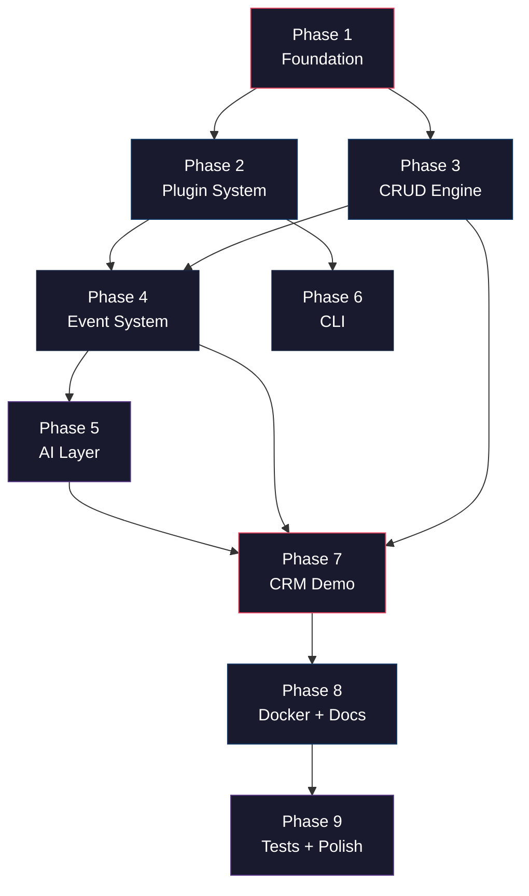

# Pravaah (NexusCore) — Development Workflow

> **Timeline**: 3–4 days · **Stack**: FastAPI · SQLAlchemy · Pydantic · Typer · OpenAI  
> **Philosophy**: *"Everything flows."*

---

## Dependency Graph

The phases must be executed in topological order. Arrows show hard dependencies.



---

## Pre-Work: Environment Setup

Before Day 1, ensure the dev environment is ready.

| Step | Command / Action | Done? |
|------|-----------------|-------|
| Create project root | `mkdir c:\Users\Shreeji\Desktop\Pravaah` | ☐ |
| Create virtual environment | `python -m venv .venv` | ☐ |
| Activate venv | `.venv\Scripts\activate` | ☐ |
| Initialize git | `git init && git checkout -b main` | ☐ |
| Create `.gitignore` | Python, IDE, `.env`, `*.db`, `__pycache__`, `.venv` | ☐ |
| Install core deps | `pip install fastapi uvicorn sqlalchemy aiosqlite pydantic pydantic-settings pyyaml typer jinja2 openai httpx` | ☐ |
| Install dev deps | `pip install pytest pytest-asyncio ruff` | ☐ |
| Freeze deps | `pip freeze > requirements.txt` | ☐ |

---

## Day 1 — Foundation + Plugin System

> **Goal**: A running FastAPI app that can discover, load, and register plugins.

---

### Phase 1: Foundation (Core Infrastructure)

> [!IMPORTANT]
> Everything depends on this phase. Do not skip ahead.

#### Step 1.1 — Project Skeleton

Create all `__init__.py` files and the directory structure:

```
nexuscore/
├── __init__.py
├── app/
│   ├── __init__.py
│   ├── main.py
│   ├── core/
│   │   ├── __init__.py
│   │   ├── config.py
│   │   ├── database.py
│   │   ├── exceptions.py
│   │   ├── registry.py
│   │   └── security.py
│   ├── engine/
│   │   └── __init__.py
│   ├── events/
│   │   └── __init__.py
│   ├── plugins/
│   │   └── __init__.py
│   ├── ai/
│   │   └── __init__.py
│   ├── middleware/
│   │   └── __init__.py
│   └── services/
│       └── __init__.py
├── cli/
│   └── __init__.py
└── plugins/
    └── __init__.py
config/
    └── nexus.yaml
```

**Acceptance**: `python -c "import nexuscore"` runs without error.

#### Step 1.2 — Config System

| File | Key Deliverables |
|------|-----------------|
| [config.py](file:///c:/Users/Shreeji/Desktop/Pravaah/nexuscore/app/core/config.py) | `NexusConfig` Pydantic Settings model; YAML → env → CLI layering; `AppConfig`, `DatabaseConfig`, `AIConfig` nested sections |
| [nexus.yaml](file:///c:/Users/Shreeji/Desktop/Pravaah/config/nexus.yaml) | Default config: SQLite, debug mode, plugin paths |

```python
# Quick test
from nexuscore.app.core.config import NexusConfig
config = NexusConfig()
assert config.app.title == "NexusCore"
```

#### Step 1.3 — Exception Hierarchy

| File | Key Deliverables |
|------|-----------------|
| [exceptions.py](file:///c:/Users/Shreeji/Desktop/Pravaah/nexuscore/app/core/exceptions.py) | `NexusCoreError` base; `PluginError`, `CRUDError`, `ConfigError`, `AIServiceError` subclasses; each carries HTTP status code |

#### Step 1.4 — Database Layer

| File | Key Deliverables |
|------|-----------------|
| [database.py](file:///c:/Users/Shreeji/Desktop/Pravaah/nexuscore/app/core/database.py) | Async `create_async_engine` + `async_sessionmaker`; `Base` declarative base with `id`, `created_at`, `updated_at`; `get_db` dependency; auto-create tables on startup |

**Acceptance**: Run a quick script that creates the engine and calls `Base.metadata.create_all`.

#### Step 1.5 — Registry

| File | Key Deliverables |
|------|-----------------|
| [registry.py](file:///c:/Users/Shreeji/Desktop/Pravaah/nexuscore/app/core/registry.py) | Singleton `NexusRegistry`; stores plugins, models, routes, hooks; `register_plugin()`, `register_model()`, `list_plugins()`, `get_model()` |

#### Step 1.6 — Security Stub

| File | Key Deliverables |
|------|-----------------|
| [security.py](file:///c:/Users/Shreeji/Desktop/Pravaah/nexuscore/app/core/security.py) | API key auth stub; `get_current_user` dependency placeholder |

#### Step 1.7 — Middleware Stack

| File | Key Deliverables |
|------|-----------------|
| [error_handler.py](file:///c:/Users/Shreeji/Desktop/Pravaah/nexuscore/app/middleware/error_handler.py) | Convert `NexusCoreError` → structured JSON; catch unhandled → 500 + request ID |
| [request_id.py](file:///c:/Users/Shreeji/Desktop/Pravaah/nexuscore/app/middleware/request_id.py) | Inject `X-Request-ID` UUID4 header; context variable for logging |
| [logging.py](file:///c:/Users/Shreeji/Desktop/Pravaah/nexuscore/app/middleware/logging.py) | Structured JSON logging: method, path, status, duration, request_id |

#### Step 1.8 — Health Check + App Factory

| File | Key Deliverables |
|------|-----------------|
| [health.py](file:///c:/Users/Shreeji/Desktop/Pravaah/nexuscore/app/services/health.py) | `/health` endpoint → `{status, version, db_ok, plugins_count}` |
| [main.py](file:///c:/Users/Shreeji/Desktop/Pravaah/nexuscore/app/main.py) | `create_app()` factory; lifespan: init DB → load plugins → register routes; middleware stack; OpenAPI metadata |

#### 🚦 Gate Check — Phase 1

```bash
# Start the server
uvicorn nexuscore.app.main:app --reload

# Verify
curl http://localhost:8000/health    # → 200 OK, JSON response
curl http://localhost:8000/docs      # → Swagger UI loads
```

```bash
git add -A
git commit -m "feat: initialize framework core — config, database, registry, middleware, app factory"
```

---

### Phase 2: Plugin System

#### Step 2.1 — Plugin Manifest

| File | Key Deliverables |
|------|-----------------|
| [manifest.py](file:///c:/Users/Shreeji/Desktop/Pravaah/nexuscore/app/plugins/manifest.py) | `PluginManifest` Pydantic model: `name`, `version`, `description`, `dependencies`, `author`; validated at load time |

#### Step 2.2 — Plugin Base Class

| File | Key Deliverables |
|------|-----------------|
| [base.py](file:///c:/Users/Shreeji/Desktop/Pravaah/nexuscore/app/plugins/base.py) | `NexusPlugin` ABC with `setup(app, registry)`, `teardown()`, `manifest` property; helper methods: `register_model()`, `register_routes()`, `register_hook()` |

#### Step 2.3 — Plugin Loader

| File | Key Deliverables |
|------|-----------------|
| [loader.py](file:///c:/Users/Shreeji/Desktop/Pravaah/nexuscore/app/plugins/loader.py) | `PluginLoader` class; scan `nexuscore/plugins/` + config paths; `importlib` dynamic loading; topological sort by dependencies; call `plugin.setup()` in order; log each loaded plugin |

#### 🚦 Gate Check — Phase 2

Create a minimal dummy plugin to test the loader:

```python
# Test: the dummy plugin loads and registers itself
uvicorn nexuscore.app.main:app --reload
curl http://localhost:8000/health  # → plugins_count >= 0
```

```bash
git add -A
git commit -m "feat: implement plugin system — manifest, base class, loader with dependency resolution"
```

---

## Day 2 — CRUD Engine + Event System

> **Goal**: Auto-generate REST APIs from models; fire events on data changes.

---

### Phase 3: Auto CRUD Engine

#### Step 3.1 — Pagination

| File | Key Deliverables |
|------|-----------------|
| [pagination.py](file:///c:/Users/Shreeji/Desktop/Pravaah/nexuscore/app/engine/pagination.py) | `PaginationParams` dependency (`page`, `page_size`, max limits); `PaginatedResponse[T]` generic schema |

#### Step 3.2 — CRUD Factory

| File | Key Deliverables |
|------|-----------------|
| [crud.py](file:///c:/Users/Shreeji/Desktop/Pravaah/nexuscore/app/engine/crud.py) | `CRUDBase[ModelType, CreateSchema, UpdateSchema]` generic class; async `create()`, `get()`, `get_multi()`, `update()`, `delete()`; filtering, sorting, pagination; lazy event dispatch; `CRUDError` handling |

#### Step 3.3 — Router Factory

| File | Key Deliverables |
|------|-----------------|
| [router_factory.py](file:///c:/Users/Shreeji/Desktop/Pravaah/nexuscore/app/engine/router_factory.py) | `create_crud_router(model, create_schema, update_schema, read_schema, prefix, tags)` function; generates 5 endpoints: `POST /`, `GET /`, `GET /{id}`, `PUT /{id}`, `DELETE /{id}`; proper OpenAPI docs, status codes |

#### 🚦 Gate Check — Phase 3

Create a test model and verify auto-generated endpoints appear in Swagger:

```bash
uvicorn nexuscore.app.main:app --reload
# Check /docs → endpoints for the test model should be visible
```

```bash
git add -A
git commit -m "feat: add dynamic CRUD engine — generic CRUD factory, router factory, pagination"
```

---

### Phase 4: Event System

#### Step 4.1 — Event Dispatcher

| File | Key Deliverables |
|------|-----------------|
| [dispatcher.py](file:///c:/Users/Shreeji/Desktop/Pravaah/nexuscore/app/events/dispatcher.py) | `EventDispatcher` singleton; `register(event_name, handler, priority)`, `async dispatch(event_name, payload)`; built-in events: `on_create:{model}`, `on_update:{model}`, `on_delete:{model}`, `on_startup`, `on_shutdown`; sync/async handler support; error isolation |

#### Step 4.2 — Event Decorators

| File | Key Deliverables |
|------|-----------------|
| [decorators.py](file:///c:/Users/Shreeji/Desktop/Pravaah/nexuscore/app/events/decorators.py) | `@on_create(model_name)`, `@on_update(model_name)`, `@on_delete(model_name)`, `@on_event(event_name)` decorators; deferred registration until plugin load |

#### Step 4.3 — Wire Events into CRUD

Go back to [crud.py](file:///c:/Users/Shreeji/Desktop/Pravaah/nexuscore/app/engine/crud.py) and replace the lazy dispatch stubs with actual calls to `EventDispatcher.dispatch()`.

#### 🚦 Gate Check — Phase 4

```python
# Test in Python REPL or script:
from nexuscore.app.events.dispatcher import EventDispatcher

dispatcher = EventDispatcher()
results = []

@dispatcher.register("on_create:TestModel")
async def handler(payload):
    results.append(payload)

await dispatcher.dispatch("on_create:TestModel", {"id": 1})
assert results == [{"id": 1}]
```

```bash
git add -A
git commit -m "feat: integrate event system — dispatcher, decorators, CRUD event hooks"
```

---

## Day 3 — AI Layer + CLI + CRM Plugin

> **Goal**: AI integration working; CLI usable; CRM plugin demonstrates the full framework.

---

### Phase 5: AI Service Layer

#### Step 5.1 — Provider Abstraction

| File | Key Deliverables |
|------|-----------------|
| [base.py](file:///c:/Users/Shreeji/Desktop/Pravaah/nexuscore/app/ai/providers/base.py) | `AIProvider` ABC; methods: `complete()`, `summarize()`, `generate()`; returns `AIResponse(text, model, usage, metadata)` |
| [openai.py](file:///c:/Users/Shreeji/Desktop/Pravaah/nexuscore/app/ai/providers/openai.py) | `OpenAIProvider(AIProvider)` with async client; configurable model/temperature/max_tokens; retry with exponential backoff |

#### Step 5.2 — Prompt Templates

| File | Key Deliverables |
|------|-----------------|
| [templates.py](file:///c:/Users/Shreeji/Desktop/Pravaah/nexuscore/app/ai/templates.py) | `PromptTemplate` class (Jinja2-style); built-in templates: `summarize`, `extract_entities`, `generate_report`; custom template registration |

#### Step 5.3 — AI Service Facade

| File | Key Deliverables |
|------|-----------------|
| [service.py](file:///c:/Users/Shreeji/Desktop/Pravaah/nexuscore/app/ai/service.py) | `AIService` facade; `generate_summary()`, `generate_report()`, `complete()`; provider-agnostic; graceful degradation if AI disabled; FastAPI dependency-injectable |

> [!TIP]
> Include a **mock/dummy provider** that returns canned responses. This allows development and testing without an OpenAI API key.

```bash
git add -A
git commit -m "feat: integrate AI orchestration layer — provider abstraction, prompt templates, service facade"
```

---

### Phase 6: CLI Tooling

#### Step 6.1 — CLI Entry Point + Commands

| File | Key Deliverables |
|------|-----------------|
| [cli/main.py](file:///c:/Users/Shreeji/Desktop/Pravaah/nexuscore/cli/main.py) | Typer app, `nexus` entry point |
| [commands/run.py](file:///c:/Users/Shreeji/Desktop/Pravaah/nexuscore/cli/commands/run.py) | `nexus run` → uvicorn dev server; `--host`, `--port`, `--reload`, `--config` options |
| [commands/plugin.py](file:///c:/Users/Shreeji/Desktop/Pravaah/nexuscore/cli/commands/plugin.py) | `nexus create-plugin <name>` → scaffold plugin from templates; `nexus list-plugins` → list registered plugins |
| [commands/model.py](file:///c:/Users/Shreeji/Desktop/Pravaah/nexuscore/cli/commands/model.py) | `nexus create-model <plugin> <model>` → scaffold model + schema |

#### Step 6.2 — Jinja2 Scaffolding Templates

| File | Key Deliverables |
|------|-----------------|
| [templates/plugin/](file:///c:/Users/Shreeji/Desktop/Pravaah/nexuscore/cli/templates/plugin) | `__init__.py.j2`, `plugin.py.j2`, `models.py.j2`, `routes.py.j2` |
| [templates/model.py.j2](file:///c:/Users/Shreeji/Desktop/Pravaah/nexuscore/cli/templates/model.py.j2) | Model scaffolding template |

#### 🚦 Gate Check — Phase 6

```bash
python -m nexuscore.cli.main run --help        # → shows options
python -m nexuscore.cli.main list-plugins       # → lists CRM (once Phase 7 is done)
python -m nexuscore.cli.main create-plugin test  # → creates nexuscore/plugins/test/
```

```bash
git add -A
git commit -m "feat: add CLI tooling — run, create-plugin, create-model, list-plugins commands"
```

---

### Phase 7: CRM Demo Plugin

> [!IMPORTANT]
> This is the **showcase**. It proves the framework works end-to-end.

#### Step 7.1 — Plugin Registration

| File | Key Deliverables |
|------|-----------------|
| [plugin.py](file:///c:/Users/Shreeji/Desktop/Pravaah/nexuscore/plugins/crm/plugin.py) | `CRMPlugin(NexusPlugin)` — registers Customer + Lead models, routes, hooks; manifest: `name="crm", version="0.1.0"` |

#### Step 7.2 — Models

| File | Key Deliverables |
|------|-----------------|
| [models.py](file:///c:/Users/Shreeji/Desktop/Pravaah/nexuscore/plugins/crm/models.py) | `Customer` model: id, name, email, phone, company, status, notes, created_at, updated_at |
| | `Lead` model: id, name, email, source, status, score, assigned_to, created_at, updated_at |

#### Step 7.3 — Schemas

| File | Key Deliverables |
|------|-----------------|
| [schemas.py](file:///c:/Users/Shreeji/Desktop/Pravaah/nexuscore/plugins/crm/schemas.py) | Pydantic v2: `CustomerCreate`, `CustomerUpdate`, `CustomerRead`, `LeadCreate`, `LeadUpdate`, `LeadRead`; validation (email format, string lengths) |

#### Step 7.4 — Custom Routes

| File | Key Deliverables |
|------|-----------------|
| [routes.py](file:///c:/Users/Shreeji/Desktop/Pravaah/nexuscore/plugins/crm/routes.py) | `POST /customers/{id}/summarize` → AI summary; `GET /crm/dashboard` → basic stats |

#### Step 7.5 — Event Hooks

| File | Key Deliverables |
|------|-----------------|
| [hooks.py](file:///c:/Users/Shreeji/Desktop/Pravaah/nexuscore/plugins/crm/hooks.py) | `@on_create("Customer")` → log new customer; `@on_update("Lead")` → recalculate score |

#### Step 7.6 — CRM Services

| File | Key Deliverables |
|------|-----------------|
| [services.py](file:///c:/Users/Shreeji/Desktop/Pravaah/nexuscore/plugins/crm/services.py) | `CRMService` — `generate_customer_summary()` via AI, `calculate_lead_score()` |

#### 🚦 Gate Check — Phase 7 (Critical!)

This is the **end-to-end validation**. Every prior phase converges here.

```bash
uvicorn nexuscore.app.main:app --reload
```

| Test | How | Expected |
|------|-----|----------|
| Plugin loads | Check startup logs | `CRM plugin v0.1.0 loaded` |
| CRUD works | `POST /api/crm/customers` with JSON body | 201 Created |
| List works | `GET /api/crm/customers` | Paginated response |
| Events fire | Create a customer, check logs | `on_create:Customer` logged |
| AI works | `POST /api/crm/customers/{id}/summarize` | AI-generated text |
| Dashboard | `GET /api/crm/dashboard` | Stats JSON |
| Swagger | Open `/docs` | All CRM endpoints documented |

```bash
git add -A
git commit -m "feat: add CRM demo plugin — full end-to-end CRUD, events, AI integration"
```

---

## Day 4 — Docker, Docs, Tests, Polish

> **Goal**: Production-ready packaging, comprehensive documentation, test coverage.

---

### Phase 8: Docker + Docs

#### Step 8.1 — Containerization

| File | Key Deliverables |
|------|-----------------|
| [Dockerfile](file:///c:/Users/Shreeji/Desktop/Pravaah/Dockerfile) | Multi-stage build: builder → runtime (slim); non-root user; health check; proper signal handling |
| [docker-compose.yml](file:///c:/Users/Shreeji/Desktop/Pravaah/docker-compose.yml) | Services: `nexuscore` app; volume mounts for config + plugins; env var pass-through |
| [.env.example](file:///c:/Users/Shreeji/Desktop/Pravaah/.env.example) | Documented env vars with defaults |

#### Step 8.2 — Project Metadata

| File | Key Deliverables |
|------|-----------------|
| [pyproject.toml](file:///c:/Users/Shreeji/Desktop/Pravaah/pyproject.toml) | PEP 621 metadata; entry point: `nexus = nexuscore.cli.main:app`; build system config |
| [requirements.txt](file:///c:/Users/Shreeji/Desktop/Pravaah/requirements.txt) | Production deps pinned |
| [requirements-dev.txt](file:///c:/Users/Shreeji/Desktop/Pravaah/requirements-dev.txt) | Test + dev deps: pytest, pytest-asyncio, httpx, ruff |

#### Step 8.3 — Documentation

| File | Key Deliverables |
|------|-----------------|
| [README.md](file:///c:/Users/Shreeji/Desktop/Pravaah/README.md) | Vision, architecture diagram, features, installation, plugin workflow, API examples, roadmap |
| [docs/architecture.md](file:///c:/Users/Shreeji/Desktop/Pravaah/docs/architecture.md) | Architecture overview with Mermaid diagrams; component interaction flows |
| [docs/getting-started.md](file:///c:/Users/Shreeji/Desktop/Pravaah/docs/getting-started.md) | Step-by-step: install → configure → create plugin → run |

```bash
git add -A
git commit -m "feat: add Docker, project metadata, and documentation"
```

---

### Phase 9: Tests + Polish

#### Step 9.1 — Test Infrastructure

| File | Key Deliverables |
|------|-----------------|
| [conftest.py](file:///c:/Users/Shreeji/Desktop/Pravaah/tests/conftest.py) | Async fixtures: test DB (in-memory SQLite), test app, test client (httpx `AsyncClient`); auto-cleanup |

#### Step 9.2 — Unit Tests

| File | Tests |
|------|-------|
| [test_crud_engine.py](file:///c:/Users/Shreeji/Desktop/Pravaah/tests/test_crud_engine.py) | Generic CRUD ops with dummy model; pagination; filtering; error cases |
| [test_event_system.py](file:///c:/Users/Shreeji/Desktop/Pravaah/tests/test_event_system.py) | Event registration; dispatch; priority ordering; error isolation |
| [test_plugin_loader.py](file:///c:/Users/Shreeji/Desktop/Pravaah/tests/test_plugin_loader.py) | Plugin discovery; loading; manifest validation; dependency ordering |

#### Step 9.3 — Integration Tests

| File | Tests |
|------|-------|
| [test_crm_plugin.py](file:///c:/Users/Shreeji/Desktop/Pravaah/tests/test_crm_plugin.py) | Create customer → 201; list leads → paginated; event hooks fire; AI summary endpoint returns response |

#### 🚦 Gate Check — Phase 9

```bash
# Run full suite
pytest tests/ -v --asyncio-mode=auto

# Run with coverage
pytest tests/ --cov=nexuscore --cov-report=term-missing

# Lint check
ruff check nexuscore/
```

```bash
git add -A
git commit -m "test: add comprehensive test suite — unit, integration, and plugin tests"
```

---

## Final Delivery Checklist

| # | Item | Status |
|---|------|--------|
| 1 | Server starts with `uvicorn nexuscore.app.main:app` | ☐ |
| 2 | `/health` returns 200 with version + plugin count | ☐ |
| 3 | `/docs` shows full Swagger UI with all CRM endpoints | ☐ |
| 4 | CRUD on Customer: Create, Read, List, Update, Delete all work | ☐ |
| 5 | CRUD on Lead: same as above | ☐ |
| 6 | Event hooks fire on create/update (visible in logs) | ☐ |
| 7 | AI summary endpoint returns meaningful response (or mock) | ☐ |
| 8 | `nexus run` starts the dev server | ☐ |
| 9 | `nexus create-plugin inventory` scaffolds a valid plugin | ☐ |
| 10 | `nexus list-plugins` shows CRM plugin | ☐ |
| 11 | `docker-compose up` runs the app successfully | ☐ |
| 12 | All tests pass with `pytest tests/ -v` | ☐ |
| 13 | README is complete with architecture diagram | ☐ |
| 14 | Git history shows clean, meaningful commits | ☐ |

---

## Git Commit Strategy (Summary)

| Phase | Commit Message |
|-------|---------------|
| Phase 1 | `feat: initialize framework core — config, database, registry, middleware, app factory` |
| Phase 2 | `feat: implement plugin system — manifest, base class, loader with dependency resolution` |
| Phase 3 | `feat: add dynamic CRUD engine — generic CRUD factory, router factory, pagination` |
| Phase 4 | `feat: integrate event system — dispatcher, decorators, CRUD event hooks` |
| Phase 5 | `feat: integrate AI orchestration layer — provider abstraction, prompt templates, service facade` |
| Phase 6 | `feat: add CLI tooling — run, create-plugin, create-model, list-plugins commands` |
| Phase 7 | `feat: add CRM demo plugin — full end-to-end CRUD, events, AI integration` |
| Phase 8 | `feat: add Docker, project metadata, and documentation` |
| Phase 9 | `test: add comprehensive test suite — unit, integration, and plugin tests` |

---

## Risk Mitigation

| Risk | Mitigation |
|------|-----------|
| Async SQLAlchemy complexity | Start with sync to unblock, migrate to async once stable |
| OpenAI API key not available | Include a `MockProvider` that returns canned responses for dev/testing |
| Plugin loader circular imports | Use `importlib` with lazy imports; topological sort catches cycles |
| Time overrun on Day 3 | AI layer and CLI are deprioritized — CRM can work without AI (graceful degradation) |
| Test flakiness with async | Use `pytest-asyncio` with `auto` mode; in-memory SQLite for speed |

---

> [!TIP]
> **Recommended workflow**: Open two terminals — one running `uvicorn --reload` for live feedback, one for git and tests. Verify each phase before moving on. The gate checks are not optional.
